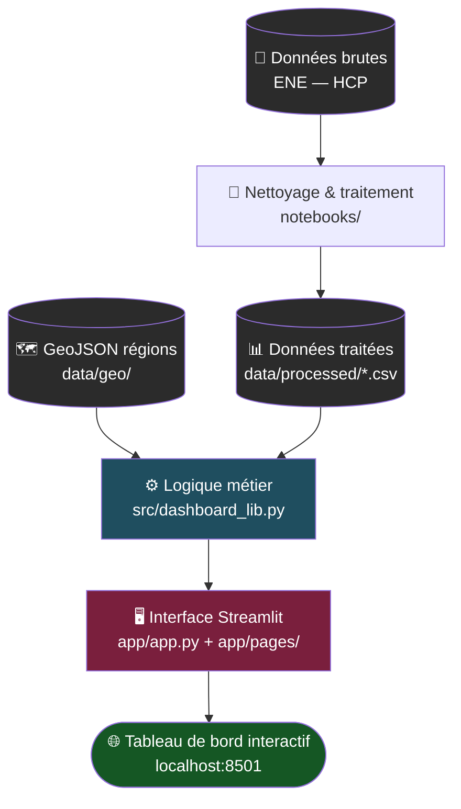

<div align="center">


# 📊 Labor Market Indicators Dashboard
### Kingdom of Morocco — Regional Analysis

*Un outil de visualisation développé au sein de la Direction Régionale de Tanger-Tétouan-Al Hoceïma (DRTTA)*

[](https://streamlit.io)
[](https://www.python.org)
[](https://plotly.com)
[](https://pandas.pydata.org)
[](#-licence)
[](#)

[Contexte](#-contexte) • [Fonctionnalités](#-fonctionnalités) • [Installation](#-démarrage-rapide) • [Structure](#️-structure-du-projet) • [Auteure](#-auteure)

</div>

---

## 🎯 Contexte

Ce projet est né pendant mon stage au **Haut-Commissariat au Plan (HCP)**, Direction Régionale de Tanger-Tétouan-Al Hoceïma. Mon encadrant m'a donné accès à leur base de données de l'**Enquête Nationale sur l'Emploi (ENE)** — un simple accès en lecture, sans cahier des charges précis. **De ma propre initiative**, j'ai identifié un besoin réel de la DRTTA (explorer visuellement une base de données jusque-là uniquement consultée via tableur) et conçu, développé et livré seule une application complète permettant de **visualiser et comparer les 12 régions du Maroc** sur quatre indicateurs clés du marché du travail.

> 💡 **L'idée** : donner à la DRTTA un outil concret pour explorer leur propre base de données, repérer plus vite les tendances régionales, et détecter d'éventuelles failles — valeurs manquantes, écarts suspects, ruptures de série — qui passeraient inaperçues dans un tableur brut.

### 🏆 Ce que ce projet démontre

- **Initiative et autonomie** : projet non demandé, identifié et mené de bout en bout sans supervision technique, de l'analyse du besoin jusqu'à la livraison d'un outil fonctionnel.
- **Compréhension métier** : traduction d'indicateurs statistiques complexes (chômage, sous-emploi, activité, emploi) en visualisations exploitables par des non-spécialistes de la donnée.
- **Rigueur sur la donnée** : nettoyage, structuration et validation d'une base de données réelle (ENE), avec détection de valeurs manquantes et d'incohérences.
- **Compétences techniques appliquées** : conception d'une architecture claire (séparation logique métier / interface), développement full-stack Python (traitement de données → visualisation → interface web déployable).
- **Sens du produit** : six vues complémentaires et synchronisées pensées pour un usage réel par une direction régionale, pas seulement comme démonstration technique.

---

## ✨ Fonctionnalités

| Fonctionnalité | Description |
|---|---|
| 🗺️ **Carte choroplèthe interactive** | Les 12 régions du Maroc, colorées selon la valeur de l'indicateur sélectionné |
| 📈 **Comparaison temporelle** | Suivi de 1 à 3 régions côte à côte, année par année |
| 🏆 **Classement régional** | Régions triées par indicateur, avec écart à la moyenne nationale |
| 🔥 **Heatmap régions × années** | Vue d'ensemble pour repérer les tendances et les anomalies |
| 🕸️ **Radar comparatif** | Comparaison multi-indicateurs entre régions |
| 🔍 **Focus régional** | Page dédiée à Tanger-Tétouan-Al Hoceïma |

Toutes les vues sont **synchronisées** : changer l'indicateur ou l'année dans la barre latérale met à jour l'ensemble du tableau de bord.

---

## 📐 Indicateurs disponibles

| Indicateur | Description |
|---|---|
| 📉 Taux de chômage | Part de la population active sans emploi |
| 📈 Taux d'emploi | Part de la population en âge de travailler occupant un emploi |
| ⚠️ Taux de sous-emploi | Part des actifs occupés travaillant moins que la durée normale, ou dans des conditions inadéquates |
| 🏃 Taux d'activité | Part de la population en âge de travailler qui est active (occupée ou en recherche d'emploi) |

---

## 🖼️ Aperçu

<div align="center">

<!-- Remplace les liens ci-dessous par de vraies captures d'écran une fois disponibles -->


<i>Carte régionale interactive, classement, comparaison temporelle et heatmap — tous synchronisés sur l'indicateur et l'année sélectionnés.</i>

</div>

---

## 🏗️ Architecture

L'application est structurée en **trois couches indépendantes**, ce qui permet de faire évoluer la donnée, la logique métier ou l'interface séparément sans tout casser :

<div align="center">

</div>

### Flux de données



### Détail des couches

| Couche | Rôle | Fichiers concernés |
|---|---|---|
| **1. Sources & traitement des données** | Ingestion de l'ENE, nettoyage, transformation, agrégation et validation avec Pandas, jointure avec le GeoJSON des 12 régions | `notebooks/`, `data/processed/`, `data/geo/` |
| **2. Back-end — Logique métier** | Accès aux données (chargement CSV/GeoJSON, mise en cache), calculs (indicateurs, agrégations, comparaisons temporelles, écarts) et génération des graphiques (cartes, séries, heatmap, radar, classements) | `src/dashboard_lib.py` |
| **3. Application — Streamlit** | Interface utilisateur (filtres, sélection de régions, navigation), pages de l'application (tableau de bord principal, focus régional) et gestion de l'état / interactivité | `app/app.py`, `app/pages/`, `app/assets/` |
| **4. Visualisations & fonctionnalités** | Résultat final exposé à l'utilisateur : carte choroplèthe, comparaison temporelle, classement régional, heatmap, radar comparatif, focus régional | Rendu dans l'interface Streamlit |

Cette séparation **logique métier / interface** est un choix délibéré : elle permet par exemple de réutiliser `dashboard_lib.py` dans un notebook d'analyse ou une future API, sans dépendre de Streamlit.

---


### Prérequis

- Python 3.10 ou supérieur
- pip

### Installation

```bash
# 1. Cloner le dépôt
git clone https://github.com/Basmaabis/regional-unemployment-dashboard.git
cd regional-unemployment-dashboard

# 2. Créer et activer l'environnement virtuel
python -m venv env
env\Scripts\activate        # Windows
# source env/bin/activate   # macOS / Linux

# 3. Installer les dépendances
pip install -r requirements.txt

# 4. Lancer l'application
streamlit run app/app.py
```

L'application s'ouvre automatiquement sur [http://localhost:8501](http://localhost:8501).

---

## 🗂️ Structure du projet

```
regional-unemployment-dashboard/
├── app/
│   ├── app.py                 # Point d'entrée Streamlit
│   ├── pages/                 # Pages secondaires (Dashboard, Focus région)
│   └── assets/                # Logos, style.css
├── src/
│   └── dashboard_lib.py       # Logique métier : data, cartes, graphiques
├── data/
│   ├── processed/              # Données nettoyées (CSV)
│   └── geo/                    # GeoJSON des régions du Maroc
├── notebooks/                  # Notebooks d'exploration et de nettoyage
├── docs/                        # Documentation complémentaire, captures d'écran
├── requirements.txt
└── README.md
```

---

## 🛠️ Stack technique

- **[Streamlit](https://streamlit.io)** — interface web interactive
- **[Python](https://www.python.org)** 3.10+
- **[Pandas](https://pandas.pydata.org)** — traitement, nettoyage et agrégation des données
- **[Plotly](https://plotly.com)** — cartes choroplèthes, heatmaps, radars, séries temporelles
- **[GeoPandas](https://geopandas.org)** — manipulation des données géospatiales (GeoJSON des régions)
- **[Altair](https://altair-viz.github.io)** — visualisations complémentaires
- **[NumPy](https://numpy.org)** — calculs numériques
- **GeoJSON** — découpage géographique des 12 régions du Maroc

---

## 📚 Source des données

**Haut-Commissariat au Plan (HCP)** — Direction Régionale de Tanger-Tétouan-Al Hoceïma
Enquête Nationale sur l'Emploi (ENE)

> ⚠️ Les données brutes ne sont pas incluses dans ce dépôt public. Seules des données traitées et anonymisées, ou des exemples illustratifs, sont partagés à des fins de démonstration.

---

## 🗺️ Feuille de route

- [ ] Ajouter des captures d'écran réelles dans `docs/screenshots/`
- [ ] Export des graphiques en PNG / PDF
- [ ] Filtrage par tranche d'âge et par sexe
- [ ] Déploiement sur Streamlit Community Cloud

---

## 📄 Licence

Ce projet est partagé à des fins de **démonstration et d'usage interne**. Les données sous-jacentes appartiennent au Haut-Commissariat au Plan (HCP) et ne sont pas couvertes par cette licence.

---

## 👩‍💻 Auteure

**Basma Abis**
Étudiante ingénieure — Filière Logiciels et Systèmes Intelligents (LSI)
Faculté des Sciences et Techniques de Tanger — Université Abdelmalek Essaâdi

Conception, développement et déploiement intégral du projet — de l'analyse des besoins de la DRTTA jusqu'à l'application finale — réalisés en autonomie dans le cadre d'un stage au HCP.

📧 [pcdebasma@gmail.com](mailto:pcdebasma@gmail.com) · [GitHub](https://github.com/Basmaabis)

---

<div align="center">
<sub>Réalisé dans le cadre d'un stage au HCP — Direction Régionale de Tanger-Tétouan-Al Hoceïma</sub>
</div>
